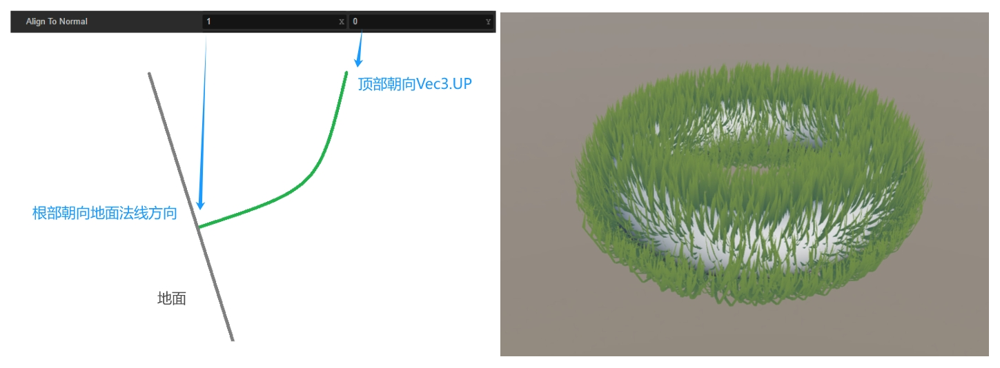

基于 GPU Instancing 的邪典式无限地图风格化草地

### 0. 序

本文主要讲的是程序化生成无限大的地图，并在上面长满草的故事。


老规矩，demo 先行：

[https://chengxu1973.github.io/stylized-grass-dist/](https://chengxu1973.github.io/stylized-grass-dist/)

如果是电脑用户，可以使用 WSAD 或者方向键来控制小鸟移动，按住鼠标左键并移动来控制视角方向；如果使用的是移动设备，可以点击屏幕并滑动来进行操作。

本文接下来会按照标题里的关键词——风格化草、GPU Instancing、无限地图三部分进行说明。

### 1. 风格化草

首先我们要生成草的 mesh，这里我们可以预设 Sharp 与 Quad 两种形状，并用 segment 参数来控制草的段数：


接下来我们需要考虑如何让地形生草。

```typescript
export interface GrassSampler {
  sample(): GrassSampleInfo;
}

export interface GrassSampleInfo {
  positions: Float32Array<ArrayBuffer>;
  normals: Float32Array<ArrayBuffer>;
  count: number;
}
```

一般的情况是在一个地形上均匀地长草，因此首先要读取地面模型的 mesh 以及贴图信息，然后在三角面内匀均随机采样，就可以获得草的生长位置，如果计算量比较大，可以考虑预计算或者使用 [task-homie](https://gist.github.com/ChengXu1973/47f5816312b5af11e4d92e01960b345e) 分帧处理：

```typescript
this._terrainPosition = mesh.readAttribute(0, ATTR_POSITION) as Float32Array;
this._terrainNormal = mesh.readAttribute(0, ATTR_NORMAL) as Float32Array;
this._terrainIndices = mesh.readIndices(0) as Uint32Array;

// 如果需要使用贴图的alpha通道作为采样用的概率
if (this.useProbabilityTexture) {
  // some code
  this._terrainTexCoord = mesh.readAttribute(0, ATTR_TEX_COORD) as Float32Array;
  director.root.device.copyTextureToBuffers(
    mainTexture.getGFXTexture(),
    [this._terrainTexture],
    [copy]
  );
  // some code
}
```

对于每一棵草来说，我们可以将地形 mesh 的每个三角形的面积作为草落在这个三角形内的概率，然后在三角形内随机生成一个点就 OK 了：


一般来说，草的根部垂直于地面，也就是指向地形的法线方向，其顶部朝上，因此我们可以用一个 alignToNormal 参数控制草的姿态：



风格化渲染最重要的是什么？就是有自己的风格，而本人最擅长的风格就是 unlit！所以我们新建一个 unlit 材质，给草添加一个绿色，搞定！

当然，如果为了让草看起来像是从地面长出来的，我们可以再添加一个地面颜色，根据草的高度做一个渐变：

```glsl
vec4 col = mix(groundColor, mainColor, 1.0 - v_uv.y);
```

同时为了让草看起来更生动，我们还可以添加风的动画，颜色渐变等等，这部分我不是很擅长，论坛里也有其他解决方案，就不再赘述。

### 2. GPU Instancing

首先需要判断一下当前环境是否支持 Instancing：

```typescript
gfx.deviceManager.gfxDevice.hasFeature(gfx.Feature.INSTANCED_ARRAYS);
```

这里说句题外话，如果设备不支持 instancing，最简单粗暴的方式就是把所有草合在一起生成一个巨大的 mesh：

```typescript
this._mesh = utils.MeshUtils.createMesh({ positions, indices, uvs }, null);
```

不过这个方案太不优雅了，孩子不喜欢。

查看引擎源码我们可以看到，创建 mesh 这一通操作最后的结果是向 RenderScene 提交了一个 renderer.scene.Model，因此我们选择自定义两种 Model：

```typescript
let model: GrassModel;
if (gfx.deviceManager.gfxDevice.hasFeature(gfx.Feature.INSTANCED_ARRAYS)) {
  model = director.root.createModel(GrassModelInstancing);
} else {
  model = director.root.createModel(GrassModelNormal);
}
```

#### 2.1 GrassModelInstancing

对于单独的一棵草来说，我们只要知道了其生长点，地面法线，就可以通过各个顶点的 uv 来计算其位置，因此 uv 属性的`isInstanced`应为`false`，而位置、法线则为`true`：

```typescript
const VERTEX_ATTRS = [
  new gfx.Attribute(
    gfx.AttributeName.ATTR_POSITION,
    gfx.Format.RGB32F,
    false,
    0,
    true
  ),
  new gfx.Attribute(
    gfx.AttributeName.ATTR_NORMAL,
    gfx.Format.RGB32F,
    false,
    0,
    true
  ),
  new gfx.Attribute(
    gfx.AttributeName.ATTR_TEX_COORD,
    gfx.Format.RG32F,
    false,
    1
  ),
] as (gfx.Attribute & { offset?: number })[];
```

一开始我们将草的 uv 信息提交之后就不用关心了：

```typescript
const vBuffer: ArrayBuffer = new ArrayBuffer(
  this._vertAttrSizeStatic * this._vertCount
);
const vbFloatArray = new Float32Array(vBuffer);
for (let i = 0; i < this._uvs.length; ++i) {
  vbFloatArray[i] = this._uvs[i];
}
vertexBuffer.update(vBuffer);
```

而草的生长点位置以及法线信息就可以每帧动态更新：

```typescript
// some code
for (let count = 0; count < info.count; count++) {
  let offset = count * this._vertAttrsFloatCount;
  this._vdataF32[offset++] = info.positions[count * 3 + 0];
  this._vdataF32[offset++] = info.positions[count * 3 + 1];
  this._vdataF32[offset++] = info.positions[count * 3 + 2];
  this._vdataF32[offset++] = info.normals[count * 3 + 0];
  this._vdataF32[offset++] = info.normals[count * 3 + 1];
  this._vdataF32[offset++] = info.normals[count * 3 + 2];
}
// some code
const ia = this._subModels[0].inputAssembler;
ia.vertexBuffers[0].update(this._vdataF32!);
ia.firstIndex = 0;
ia.indexCount = this._indexCount;
ia.instanceCount = count;
ia.vertexCount = this._iaVertCount;
```

创建出来的 Model 最后由持有它的 ModelRenderer 添加至场景就可以了：

```typescript
this._getRenderScene().addModel(model);
```

上面我们提到，对于单独的一棵草只要知道了其生长点与法线，就可以通过顶点 uv 来计算顶点位置，我们来看看 shader 的部分（伪代码）：

```glsl
float v_heightFactor = 1.0 - uv.y;
vec3 growDir = balabala(noise, align);
vec3 rightDir = cross(finalNormal, viewDir);

growDir = normalize(growDir);
rightDir = normalize(rightDir);

vec2 realSize = balabala(noise, size);

float xOffset = uv.x - 0.5;
worldPos += xOffset * realSize.x * rightDir +
    v_heightFactor * realSize.y * growDir;
```

首先使用世界坐标获取一个唯一的随机因子 noise，然后用随机因子计算草的旋转方向与大小，接着根据草的 uv 将生长点位置进行偏移便得到了最终的顶点位置：


#### 2.2 GrassModelNormal

GrassModelNormal 相比于 GrassModelInstancing 就简单很多，我们将数据都合在一起提交给渲染场景就 vans 了：

```typescript
// some code
for (let count = 0; count < info.count; count++) {
  for (let vert = 0; vert < this._vertCount; vert++) {
    let offset = (vert + count * this._vertCount) * this._vertAttrsFloatCount;
    this._vdataF32[offset++] = info.positions[count * 3 + 0];
    this._vdataF32[offset++] = info.positions[count * 3 + 1];
    this._vdataF32[offset++] = info.positions[count * 3 + 2];
    this._vdataF32[offset++] = info.normals[count * 3 + 0];
    this._vdataF32[offset++] = info.normals[count * 3 + 1];
    this._vdataF32[offset++] = info.normals[count * 3 + 2];
    this._vdataF32[offset++] = this._uvs[vert * 2 + 0];
    this._vdataF32[offset++] = this._uvs[vert * 2 + 1];
  }
}
// some code
const ia = this._subModels[0].inputAssembler;
ia.vertexBuffers[0].update(this._vdataF32!);
ia.firstIndex = 0;
ia.indexCount = this._indexCount * count;
ia.vertexCount = this._iaVertCount;
```

### 3. 无限地图

为了让小鸟在无尽的草地上自由奔跑，我们要分别解决地形与草的生成及渲染问题。

#### 3.1 地形生成

程序化生成哪家强，perlin noise 帮大忙！

通过采样噪声图作为高度，可让地形有所起伏，为了地图能够无穷无尽，我有两种方案：

1. 生成一张大一点的贴图，并分为 9 个区块，保证每个区块能覆盖相机的 far，在跨越区块时，我们将当前区块更新至中间并重置一下坐标，搭配阈值与分帧策略，理论上可以用于制作任意的地形；
2. 制作一张噪声图，然后按照中心对称的方式拼接一下，采样时搭配 repeat 模式就可以了。

注意到标题里面的邪典关键词，所以我们选方案二。

首先在网上找一张 128 的 perlin noise 贴图，然后手动拼接一下，真是辛苦我了


#### 3.2 地形渲染

由于相机只能看到无尽地图的一部分，所以我们也只需要渲染这一部分就可以了，这里又有两种思路：

1. 生成一系列地块，当相机移动时，我们计算出需要显示的地块，并根据距离相机的远近以及 LOD 策略进行渲染；
2. 放一个面片模型到相机面前，相机无论转到哪里都显示的是这个面片，在顶点着色器里面根据高度调整顶点位置就可以了。

注意到标题里面的邪典关键词，所以我们选方案二。


那么问题来了，地形渲染搞定了，那角色移动怎么办？只能在 CPU 里面采样一次了，首先拷贝一下纹理数据：

```typescript
width = this.noise.width;
height = this.noise.height;
this._pixels = new Uint8Array(width * height * 4);
const region = new gfx.BufferTextureCopy();
region.texOffset.x = 0;
region.texOffset.y = 0;
region.texExtent.width = width;
region.texExtent.height = height;
director.root.device.copyTextureToBuffers(
  this.noise.getGFXTexture(),
  [this._pixels],
  [region]
);
```

然后根据位置采样一下：

```typescript
u = this.node.worldPosition.x * this.terrainScale;
v = this.node.worldPosition.z * this.terrainScale;
// 修正至像素中心
u -= 0.5 / width;
v -= 0.5 / height;
// 归一化
u = u - Math.floor(u);
v = v - Math.floor(v);
// 像素坐标
x = u * width;
y = v * height;
// 双线性采样的四个邻近像素坐标
x0 = Math.floor(x);
y0 = Math.floor(y);
x1 = x0 + 1;
y1 = y0 + 1;
// repeat模式
x0 = (x0 + width) % width;
y0 = (y0 + height) % height;
x1 = (x1 + width) % width;
y1 = (y1 + height) % height;
// 取像素r通道
r00 = this._getPixel(x0, y0, 0);
r10 = this._getPixel(x1, y0, 0);
r01 = this._getPixel(x0, y1, 0);
r11 = this._getPixel(x1, y1, 0);
// 计算权重
dx = x - x0;
dy = y - y0;
w00 = (1 - dx) * (1 - dy);
w10 = dx * (1 - dy);
w01 = (1 - dx) * dy;
w11 = dx * dy;
// 加权
r = r00 * w00 + r10 * w10 + r01 * w01 + r11 * w11;
```

最后我们根据采样的值设置一下节点坐标，这样我们的小鸟就能爪踏实地了！

#### 3.3 远处的草

远处的草很小，所以和地形一样，跟着相机移动就可以了。

如果实在很远，不渲染也是 OK 的，我们在渲染地面时在地上显示一点斑驳的绿点就可以了，这里取一下深度值再混合一下颜色就 OK：

```glsl
// vert
cam_diatance = position.z / cc_nearFar.y;

// frag
vec4 col = mix(mainColor, subColor, cam_diatance * texture(mainTexture, 0.1 *worldPos.xz).r);
```

#### 3.4 近处的草

近处的草不能再跟随相机移动，所以得分块之后按需展示，和正常的地块逻辑差不多。

但是考虑到草的生长是杂乱无章的，我们可以只生成一小块草的位置信息，然后每一块都单位的“复制粘贴”这一部分位置信息就可以：

```typescript
// some code
colMin = Math.floor((x - this.shownRadius) / this.unitSize);
colMax = Math.ceil((x + this.shownRadius) / this.unitSize);
rowMin = Math.floor((z - this.shownRadius) / this.unitSize);
rowMax = Math.ceil((z + this.shownRadius) / this.unitSize);
for (let i = colMin; i <= colMax; i++) {
  for (let j = rowMin; j <= rowMax; j++) {
    offsetX = i * this.unitSize;
    offsetY = j * this.unitSize;
    for (let index = 0; index < this._unit.count; index++) {
      // 复制一下生长点信息
    }
  }
}
```

最后看起来就是这样：


### 4. 结语

本文涉及的所有技术点以及思路在网上都有公开资料，但是组织成工程代码还是需要费点事的，因此不直接提供源码。有需要的可以去 Cocos Store 购买，商店链接等审核过后放出（或者反编译 demo 代码也可以，毕竟是纯前端项目）。

欢迎各位交流反馈。

最后贴一下模型 Liscense：

> [ "Sparrow - Quirky Series" ](https://skfb.ly/oE6QR) by Omabuarts Studio is licensed under[ Creative Commons Attribution ](http://creativecommons.org/licenses/by/4.0/).
